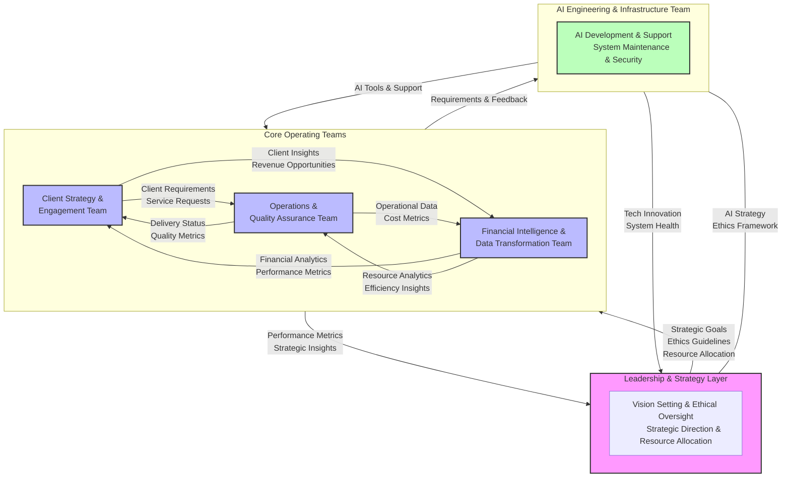

# **The Rise of AI-Enabled Organization Design: Building Tomorrow's Tax Firm Today**

### **1. Document Purpose**

- To provide a structured guide on implementing a **Core Team Structure** for modern accounting firms.
- Outline the purpose, philosophy, and functions of each team in a way that balances ethical values with operational excellence.
- Support firms in transitioning from traditional organizational models to an adaptable, AI-integrated structure that enhances client satisfaction, employee engagement, and long-term strategic growth.

---

### **2. Underlying Philosophy**

- **People-Centered and Ethical**: This structure is designed to prioritize the value and growth of individuals within the firm, recognizing that a supportive, ethically grounded environment leads to sustainable success.
- **AI-Enhanced Human Roles**: AI is not a replacement for human roles but a support tool that empowers professionals to focus on strategic, creative, and client-centric tasks.
- **Adaptability and Continuous Improvement**: The structure emphasizes flexibility and the ability to evolve with changing industry demands, technologies, and client expectations.
- **Client-Driven Value with Business Impact**: This model is rooted in delivering meaningful, high-impact services to clients while balancing efficiency and profitability through operational excellence.

#### The Catalyst for Change

The accounting profession stands at the threshold of its most exciting transformation since the advent of computerized spreadsheets. The emergence of AI isn't just adding new tools to our arsenal – it's giving us the opportunity to fundamentally reimagine how tax firms operate. Just as the introduction of computers transformed how we work with financial information, AI enables us to rebuild our organizational architecture from first principles.

---

### **3. Overview of the Core Team Structure**

- The Core Team Structure comprises five integrated teams, each with specific functions and AI-enabled support to optimize performance, quality, and client experience.
- Each team leverages AI agents to support critical tasks, reduce repetitive work, and ensure high standards across services and internal processes.

---

### **4. The Five Core Teams**

#### **4.1 Leadership & Strategy Layer**

- **Purpose**: To set the vision, uphold ethical standards, and align the firm’s strategies with long-term goals while ensuring the greatest overall benefit for all stakeholders, including clients, employees, and society.
- **Key Roles & Responsibilities**:
  - Develop firm-wide strategy and oversee resources with a focus on maximizing positive outcomes for all stakeholders.
  - Provide ethics oversight to ensure AI implementation is balanced to maximize both profitability and human value.
  - Monitor performance metrics to align with strategic objectives, balancing the pursuit of commercial gains with the overall well-being of clients and staff.
- **AI Integration**:
  - **Competitive Intelligence Agent**: Monitors industry trends and competitor actions to identify strategic opportunities that deliver the most significant benefit.
  - **Regulatory Compliance Agent**: Keeps the firm updated on regulatory changes to ensure compliance and reduce risk for all stakeholders.
  - **Strategic Insight Agent**: Provides data-driven insights for strategic planning that prioritize actions offering the highest net benefit.
- **A Day in the Life**:
  - Morning strategy sessions combining AI-driven market insights with human judgment, aimed at identifying opportunities that yield the greatest positive impact.
  - Evaluating new AI implementations not only for efficiency gains but also for their broader impact on employee development and client satisfaction.
  - Collaborative planning with team leaders to allocate resources where they will create the greatest value, fostering professional growth alongside commercial success.
- **Success Story**:
  - Our Leadership team recently used AI insights to identify a growing demand for specialized tax advisory services in the healthcare sector. By leveraging predictive analytics, they developed a new suite of services tailored to healthcare providers, proactively capturing market share and addressing unmet client needs. This initiative led to increased profitability and positioned the firm as a leader in the healthcare industry, demonstrating our commitment to anticipating client demands and driving strategic growth.
- **Ethics in Action**:
  - "When evaluating new AI tools, our leadership team asks questions like 'How can this help us expand our market share or improve profitability while enhancing service quality?' For example, they recently chose an AI-driven client analytics tool that enabled us to predict emerging client needs and design new services around them. This decision helped us capture additional market share, improve client retention, and ensure that our services remain relevant and highly valued."

#### **4.2 Client Strategy & Engagement Team**

- **Purpose**: To foster strong client relationships and deliver high-value, customized advisory services that also drive revenue growth.
- **Key Roles & Responsibilities**:
  - Manage client relationships, offering proactive, personalized advice.
  - Communicate effectively with clients and build tailored value propositions.
  - Identify opportunities to expand services and increase client retention.
  - Integrate Marketing to align with client engagement and growth initiatives.
- **AI Integration**:
  - **Client Insight Agent**: Analyzes client data for customized service and identifies upsell opportunities.
  - **Sentiment Analysis Agent**: Tracks client feedback and engagement to improve service satisfaction and identify potential areas of expansion.
  - **Proposal Drafting Agent**: Automates client proposals based on preferences and past interactions to expedite business development.
  - **Predictive Content Engine**: Suggests content topics based on client interests to improve engagement.
- **A Day in the Life**:
  - AI-assisted morning review of client needs and opportunities, focusing on both client satisfaction and revenue growth.
  - Strategic planning sessions with clients, enhanced by predictive analytics.
  - Collaborative solution design with other core teams to deliver high-impact, profitable services.
  - Marketing-driven content campaigns aligned with client needs and upcoming opportunities.
- **Team Interaction Example**:
  - When the AI flagged changing patterns in a client's industry, our team partnered with Financial Intelligence to develop a proactive advisory package, demonstrating our commitment to client success and long-term partnership value.

#### **4.3 Operations & Quality Assurance Team**

- **Purpose**: To maintain service quality, ensure compliance, and optimize workflows for consistency, efficiency, and profitability.
- **Key Roles & Responsibilities**:
  - Manage workflow quality, compliance, and risk mitigation.
  - Streamline processes to improve service delivery, reduce errors, and enhance cost efficiency.
- **AI Integration**:
  - **Quality Assurance Agent**: Automates compliance checks and quality reviews to reduce manual workload and improve accuracy.
  - **Risk Prediction Agent**: Detects potential risks based on data patterns, minimizing financial losses.
  - **Checklist Automation Agent**: Tracks task completion and improves quality control while enhancing operational efficiency.
- **A Day in the Life**:
  - AI handles routine compliance checks, enabling team members to focus on higher-value activities.
  - Team members focus on complex technical reviews and opportunities to improve efficiency.
  - Cross-team collaboration on process improvement to reduce costs.
- **Growth Story**:
  - "Since implementing AI quality checks, our team has reduced review time by 40%, leading to significant cost savings. We've used this time to develop specialized expertise and mentor junior staff, ensuring both efficiency and career growth." - Michael, Quality Lead
- **Career Evolution Narrative**:
  - **Traditional Tax Accountant → Strategic Advisor**: "Maria's role transformed from spending 70% of her time on compliance checks to leading client strategy sessions. AI handles the routine compliance, allowing her to develop deep industry expertise and provide proactive insights her clients never knew they needed, thereby increasing client loyalty."

#### **4.4 Financial Intelligence & Data Transformation Team**

- **Purpose**: To deliver actionable financial insights, monitor firm health, and support data-driven decisions to maximize profitability.
- **Key Roles & Responsibilities**:
  - Analyze financial data for internal and client-facing insights.
  - Use predictive models to anticipate trends, optimize resource allocation, and track financial performance for improved profitability.
- **AI Integration**:
  - **Financial Forecasting Agent**: Projects revenue and expense trends to support strategic financial planning.
  - **Anomaly Detection Agent**: Identifies financial data irregularities to mitigate risks early.
  - **Resource Utilization Agent**: Tracks costs and resource allocation to optimize efficiency.
- **A Day in the Life**:
  - Morning AI-driven anomaly review to identify potential financial issues.
  - Collaborative analysis sessions with client teams to drive business growth.
  - Strategic planning with leadership to align financial insights with broader business goals.
- **Innovation Example**:
  - The team recently developed a predictive model that helps clients anticipate cash flow challenges months in advance, combining AI capability with human financial expertise to reduce risk and increase client satisfaction.
- **Client Partnership Evolution**:
  - **From Reactive to Proactive**:
    - Before: Annual tax planning meetings
    - Now: AI-enabled continuous monitoring with human-led strategic intervention
    - Result: Clients view us as year-round strategic partners, strengthening client loyalty and improving firm profitability.
  - **Success Story**: "A mid-size manufacturing client was considering overseas expansion. Our AI flagged changing international tax regulations, enabling our Client Strategy team to proactively prepare a comprehensive analysis. The client's CFO noted, 'You're thinking about our business even when we're not,' which strengthened our partnership and led to additional service engagements."

#### **4.5 AI Engineering & Infrastructure Team**

- **Purpose**: To build, maintain, and improve AI systems that support all teams and drive innovation, ensuring both ethical integrity and commercial benefit.
- **Key Roles & Responsibilities**:
  - Develop and deploy AI tools and models for firm-wide support.
  - Oversee system security, integration, and continuous improvement of AI functions with a focus on delivering business value.
- **AI Integration**:
  - **Document Handling Agent**: Organizes and processes client documents to streamline workflows and reduce administrative costs.
  - **AI Lifecycle Management Agent**: Manages updates and monitors AI performance to ensure maximum effectiveness and efficiency.
  - **Security & Compliance Agent**: Enforces data security protocols and ensures compliance while optimizing processes for reduced risk.
- **A Day in the Life**:
  - Continuous improvement of AI tools based on team feedback to maximize business impact.
  - Collaboration with all teams to understand needs and improve tools that directly enhance profitability and efficiency.
  - Security and ethics reviews of new capabilities to ensure ethical standards without compromising commercial outcomes.
- **Cultural Impact**:
  - "We see ourselves as enablers of human potential. Every tool we build starts with the question: How will this help our colleagues serve clients better and make our firm more efficient?" - Alex, AI Engineering Lead
- **Ethics in Action**:
  - "Our AI engineers recently developed a 'Professional Growth Tracker' that identifies opportunities for accountants to engage in more strategic work. Unlike traditional metrics focusing solely on utilization, this tool highlights where AI can take over routine tasks to create space for higher-value activities, driving both career growth and firm efficiency."

---

### **5. Core Team Structure Table**

| **Core Team**                                    | **Purpose**                                                | **Key Roles & AI Integration**                                                                                                                                         | **Core Principles & Metrics**                                                                                               | **Impact & Success Stories**                                                      |
| ------------------------------------------------ | ---------------------------------------------------------- | ---------------------------------------------------------------------------------------------------------------------------------------------------------------------- | --------------------------------------------------------------------------------------------------------------------------- | --------------------------------------------------------------------------------- |
| **Leadership & Strategy Layer**                  | Set vision, align strategy with ethics & goals             | Strategic planning, ethics oversight, resource allocation, performance monitoring.  **AI**: Competitive Intelligence, Regulatory Compliance, Strategic Insight Agents. | **Ethical Leadership**: Integrity-driven success.  **Metrics**: Growth, compliance, ethical alignment.                      | Ethical innovation, strategic foresight.  Sustainability initiative in reporting. |
| **Client Strategy & Engagement**                 | Strengthen client relationships, enhance client experience | Relationship management, advisory services, value propositions, marketing alignment.  **AI**: Client Insight, Sentiment Analysis, Proposal Drafting, Predictive Content Agents. | **Client-Centric Focus**: Client satisfaction and expansion.  **Metrics**: Retention, satisfaction, proposal conversion.    | Proactive partnerships, advisory packages for industry changes.                   |
| **Operations & Quality Assurance**               | Maintain quality, ensure compliance, optimize workflows    | Process optimization, compliance, quality control.  **AI**: Quality Assurance, Risk Prediction, Checklist Automation Agents.                                           | **Consistency & Reliability**: Accurate workflows, cost efficiency.  **Metrics**: Error rates, task completion, compliance. | Efficiency gains, mentoring junior staff.  Reduced review time.                   |
| **Financial Intelligence & Data Transformation** | Provide financial insights, track firm health              | Financial analysis, predictive modeling, data analytics.  **AI**: Financial Forecasting, Anomaly Detection, Resource Utilization Agents.                               | **Data-Driven Decisions**: Analytics-based strategy.  **Metrics**: ROI, cost savings, financial health.                     | Predictive cash flow models.  Improved client partnerships.                       |
| **AI Engineering & Infrastructure**              | Develop & maintain AI systems, drive innovation            | AI development, system maintenance, integration.  **AI**: Document Handling, AI Lifecycle Management, Security & Compliance Agents.                                    | **Continuous Improvement**: Secure, adaptable AI ecosystem.  **Metrics**: Adoption, uptime, security compliance.            | Enhanced client service efficiency.  Ethical AI tools development.                |

---

---

### **6. Benefits of the Core Team Structure**

- **Enhanced Client Relationships**: Streamlined client services and data-driven insights improve satisfaction and client retention.
- **Increased Operational Efficiency**: AI supports workflow optimization, reducing repetitive tasks and freeing professionals to focus on strategy, thus increasing profitability.
- **Stronger Ethical and Strategic Alignment**: The Leadership layer ensures that AI supports the firm's goals, ethical standards, and commercial needs.
- **Data-Driven Financial Management**: The Financial Intelligence team uses AI insights to support proactive financial decisions that enhance profitability.
- **Robust AI Infrastructure**: Continuous improvement from the AI Engineering team ensures future readiness, data security, and business impact.

---

### **7. Conclusion**

- This Core Team Structure represents a balanced, future-focused approach that leverages AI to enhance both client and employee experiences while meeting commercial objectives.
- By integrating ethical principles with operational excellence, firms can create a workplace that attracts top talent, enhances client relationships, and supports sustainable growth.

#### Evidence-Based Transformation

Our Core Team Structure directly addresses documented industry challenges:

- Education Pipeline: While accounting degree completions have dropped 16.9% over the past decade, our structure creates engaging career paths that attract new talent.
- Retention Crisis: Against industry turnover rates of 15%, our AI-enhanced roles provide growth opportunities that keep professionals engaged.
- Emerging Services: As the profession evolves toward advisory services in ESG, cryptocurrency, and data analytics, our structure enables continuous adaptation to new opportunities.

### **A Vision of Possibility**

Imagine walking into your accounting firm and feeling energized by the possibilities ahead. Instead of drowning in routine tasks, you're collaborating with AI tools that handle the repetitive work, freeing you to focus on what truly matters - understanding your clients' challenges, crafting innovative solutions, and growing as a professional.

This isn't just a dream - it's the reality we're creating through our Core Team Structure. While many see AI as a threat to accounting jobs, we see it differently. We're building a future where technology enhances rather than replaces human capability, where ethical principles guide innovation, and where every team member has the opportunity to do their most meaningful work.

### **The Journey Ahead**

We understand that transforming our organization structure isn't just about moving boxes on an org chart - it's about reimagining how we work together, grow together, and serve our clients together. This journey will have its challenges, but we're committed to supporting every team member through this transition.

#### **Sarah's Story: A Day in Our Future**

*Sarah, a Senior Tax Accountant in our Operations & Quality Assurance Team, shares her experience:*

"When I first heard about AI integration, I was worried about becoming obsolete. Now, I can't imagine working any other way. My AI assistant handles routine calculations and compliance checks, giving me time to dive deep into complex client scenarios. Yesterday, I collaborated with our Client Strategy team on a challenging international tax structure - the kind of strategic work I never had time for before. The best part? I'm learning and growing every day."

### **Supporting Your Transition**

We're committed to making this transformation successful for every team member:

#### Why This Matters Now

- 75% of current public accounting CPAs will retire within 15 years
- The median age of accounting professionals has increased to 42 years
- Master's degree completions fell 6.4% in 2021-2022

These trends create both urgency and opportunity. Our Core Team Structure positions us to attract the next generation of talent while creating enriching career paths for current professionals.

#### **Professional Development Pathways**

- Personalized learning journeys
- Mentorship programs
- Cross-team rotation opportunities

#### **Change Support**

- Regular open forums for questions and concerns
- Dedicated transition coaches
- Pilot programs for testing new ways of working

#### **Measuring Success**

We measure our success not just in numbers, but in human and business terms:

- Professional growth and satisfaction
- Work-life balance improvements
- Client relationship depth
- Innovation and creativity
- Ethical impact
- Profitability improvements

### **Looking Ahead: Our Continuous Evolution**

This structure isn't a final destination - it's a framework for continuous growth and adaptation. We're committed to:

- Regular feedback and adjustment
- Ongoing innovation in how we work together
- Maintaining our ethical foundations while embracing new possibilities to enhance commercial success

### **Join Us in Building the Future**

We're not just changing how we work - we're redefining what's possible in professional services. This is your invitation to be part of that journey, to help shape a future where technology and humanity work in harmony to create something extraordinary.

Ready to learn more about your role in our future? Reach out to your team leader or our transition support team.

---

*"The best way to predict the future is to create it." - This has never been more true than in our journey to build an ethical, human-centered future for tax accounting.*

